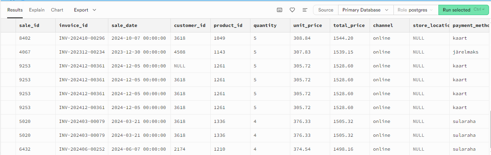

# Müügikanalid ja asukohad
# Vaatan kanalitega seotud veerge
SELECT channel, store_location, payment_method FROM sales LIMIT 10;

# Leian kõik müügikanalid mida Urbanstyle kasutab:
SELECT DISTINCT channel FROM sales;   

tulemuseks on 2 kanalit: online ja pood

# Nimekiri linnadest kus Urbanstyle poed asuvad:
SELECT DISTINCT store_location FROM sales;

tulemuseks on: Tallinn,Tartu,Pärnu, NULL (s.t et asukoht pole märgitud, võib olla veebipood)

# Nimekiri makseviisidest mida kliendid kasutavad :
SELECT DISTINCT payment_method FROM sales;

tulemuseks on : järelmaks, kaart, sularaha

# Leia 15 suuremat tehingut, mis on tehtud veebipoe kaudu:
SELECT * FROM sales    
WHERE channel = 'online'    
ORDER BY total_price DESC    
LIMIT 15; 

# Leia tehingud ilma asukoha infota. Mitu tehingut on, kus kaupluse asukoht on puudu (NULL)?

SELECT COUNT(*) AS puuduv_asukoht    
FROM sales    
WHERE store_location IS NULL;

tulemus on 5284 tk
sama tulemuse annab päring kui otsida Where channel=online

# Tegin lisapäringu ja leidsin vastuolu: kui channel=online siis kasutusel on maksemeetod ka sularaha

# Lisaülesanded : online tehingute arv

SELECT COUNT(*) AS online_tehinguid   
FROM sales   
WHERE channel = 'online';
tulemus on 5204

# poe tehingute arv:
SELECT COUNT(*) AS poe_tehinguid   
FROM sales   
WHERE channel = 'pood';   `

tulemus on 10030

# Lühike kokkuvõte
Müügikanaleid on 2 : online ja pood
Poed asuvad kolmes linnas : Tallinn, Tartu, Pärnu.
Poe asukoht ei ole alati määratud (NULL e. siis on tegemist e-poe ostuga)
Makseviise on kasutusel 3 erinevad: järelmaks, kaart, sularaha
Ilma asukohata tehinguid oli 5204
Leidsin vastuolu - e-poe ostul on makseviisiks märgitud sularaha

