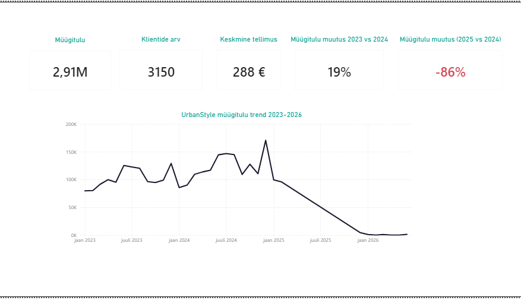

# Nädal 5: UrbanStyle.ltd Dashboard investoritele

## Projekti ülevaade
Selle nädala eesmärk oli luua interaktiivne dashboard, mis annab tegevjuht Kristi Tammele ja potentsiaalsetele investoritele 30 sekundiga ülevaate ettevõtte tervistest. 
Fookuses oli andmete visualiseerimine  - kuidas muuta toornumbrid strateegilisteks otsusteks
.

## Äriprobleem

UrbanStyle valmistub investorite kohtumiseks, et kaasata 500 000 eurot laienemiseks
. 
Selleks oli vaja visualiseerida neli kriitilist küsimust:

- Kas ettevõte kasvab ajas? (Müügitulu trend)

- Millised on meie populaarseimad tooted ja kategooriad?

- Kust tulevad meie kliendid ja milliseid kanaleid nad kasutavad?

- Kas turundus on efektiivne?

## 🛠 Tehnilised oskused ja tööriistad

**Visualiseerimise rada:** track A - Power BI, DAX 

**Disainipõhimõtted:** Rakendasid F-pattern hierarhiat (olulisim info vasakul üleval) ja hoidsin Data-Ink Ratio madalana, eemaldades liigse müra

## Dashboardi komponendid

**1. KPI kaardid (Hero Numbers)**
Paigutasin dashboardi ülemisse serva viis näitajat
:
- Kogukäive (Total Revenue): [2.91M]

- Klientide arv: [3150]

- Keskmine tellimus (AOV): [288 €]

- Müügitulu kasv % (YoY): [19%]

- Müügitulu muutus % (YoY): [-86% ]

**2. Müügitulu trend (Line Chart)**

Kasutasin joondiagrammi, et näidata käibe muutust kuude lõikes

**Leid:** Graafik näitab stabiilset kasvu kuni 2024. aasta lõpuni, mil saavutati tipphetk

**Märkus:** Tuvastasin andmelünga 2025. aasta märtsist novembrini, mis vajab IT-direktor Toomas Kase abi andmete taastamiseks
.

**Dashboard:**

## 🧭 Ärilised soovitused Kristile

Tuginedes dashboardile, on minu soovitused juhtkonnale järgmised
:
**Andmekvaliteedi parandamine:** Enne investorite kohtumist tuleb kõrvaldada 2025. aasta andmelüngad, et vältida eksitavat negatiivset trendi graafikul
.

**AI kasutamine :**
Kasutasin AI abi Power BI kasutamisel, kuna mul oli eestikeelne Power BI seadistus, mis muutis kasutamise juhendit järgides pisut keeruliseks.
AI aitas ka DAX valemite koostamisel.

Grupitöö :https://github.com/silvervarusk/Sales-Analytics/tree/main/05_Power

